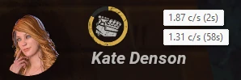

# Bloodpoint Farming Macros!
Macros to help with the repetitive/tedious aspects of farming bloodpoints in Dead by Daylight!

> [!CAUTION]
> These macros are focused on reducing repetitive stress injures while farming--not competitive advantage. However, they are still at odds with the BHVR Terms of Use. Use them at your own risk.

## How to Use
1. Install [AutoHotkey v2](https://www.autohotkey.com/).
2. Download the latest macros at https://BloodpointFarming.github.io/Bloodpoint-Farming-Macros/Bloodpoint-Farming-Macros.zip
3. Extract *everything* in the zip file.
4. Open the .ahk files you want to run. (e.g. just double click them)
5. To turn off the macro, open your system tray > right click the macro > Exit

## General Macros
### Autospend
- F6 to purchase tagged items from the bloodweb using the [fast bloodweb tech](https://www.reddit.com/r/deadbydaylight/s/njguTZBODp).
  - ⚠️ this can cause DBD to bug out until restarted.
  - Disabled by default. Edit the macro to set `useBloodwebCycling := true` to enable.
- Demo: https://youtu.be/h3Yr9y5W7GU
- Supports 1080p and 1440p resolutions at 100% UI scale only. Run windowed at these resolutions if you need to. Disable filters if they interfere.
- Use [NightLight](https://nightlight.gg/desktop) to tag the icons you want prioritized from the 🟥 🟪 🟦 🟩 🟫 version of the [bloodpoint-farming-autospender icon pack](https://nightlight.gg/packs/bloodpointfarmingautospender). Untagged items are autopurchased.
  - Alternatively, manually manage the tagged icons in `C:\Program Files (x86)\Steam\steamapps\common\Dead by Daylight\DeadByDaylight\Content\UI\Icons`
- To reload icons, close and reopen the bloodweb. (If that doesn't work, Play > Learn to Play > Survivor Tutorial > Exit.)
- Purchase order is based off of the 5 colored tags: Pink > Purple > Blue > Green > Brown

### Auto Click
- Auto-clicker for spending bloodpoints or spamming M1 in a reactive healing circle.
- F3 = Toggle ON / F4 or WASD = Toggle OFF

### Ready Up
- Clicks the ready button as soon as it becomes visible.
- Disables if the user manually unreadies.
- Re-enables if the user readies up again.

### Continue
- Auto-clicks the CONTINUE button.

### Tally
- Captures BP, Scoreboard, Emblems, XP, etc. during the Tally screen and saves a screenshot to `%userprofile%\Pictures\dbd-matches\`.
- Keeps newest 300 screenshots
- 

  
Screenshot

  
  

### Tally Continue
- Does everything that [Tally](#Tally) does, but also...
- Clicks the CONTINUE button.

### Space Spam
- Spams space bar events while the actual space bar is held down.
- Useful for failing skill checks to regress a generator quickly.

### Match Timer
- A simple match timer that resets when the black bars at the top/bottom of the screen fully disappear.
- Window is always on top and draggable.

### Abandon Match
- Uses the Abandon Match feature as soon as available.
- If that doesn't work, activate manually with Ctrl+Shift+A.
- UI scale must be 100%

### Repair Speed Tracker
- Tracks repair speed over time for analyzing builds and identifying perk interaction bugs.
- Shows repair speed in the HUD over:
  - the past 2 seconds
  - the whole gen
    
- Optional: exports raw data to a TSV file in `%TEMP%\repair` named like `2025-09-25_22-09-21 repair 58 pct in 41.9 sec 1.24 cps.tsv`
- Pausing/resuming repair for up to 5 seconds is considered the same repair session (e.g. bounce tech, switching toolbox)
- Create pretty graphs in google sheets, excel, or your tool of choice

## Killer macros
### Killer Shuffle
- Killer will repeatedly move forwards and backwards in place to allow survivors to get into chase (Spin blinding, Gen dancing, etc.).
- F2 = start dancing
- WASD = stop dancing

### Killer Hit Counter
- Show a counter for the number of times you M1.
- Useful for killers to track the number of self-care hit rotations in Reactive builds.
- Disappears after 15 seconds of no hits.
- `Ctrl+` and `Ctrl-` to manually set (if necessary)
- `Ctrl+R` to reset to 0.

### Killer Autohook
- Hooks a carried survivor when possible.
- Adds years of life to your keyboard's spacebar.
- UI scale must be 100%

## Automatic Updates
Scripts automatically check for updates and ask to update when new fixes and macros are added.

> [!IMPORTANT]  
> Updating will overwrite the whole directory, including any macro changes or new files you've added.
> If you'd prefer to manage updates manually, `git clone https://github.com/BloodpointFarming/Bloodpoint-Farming-Macros.git` instead. Scripts will not auto-update if they're run from in a git repo.
